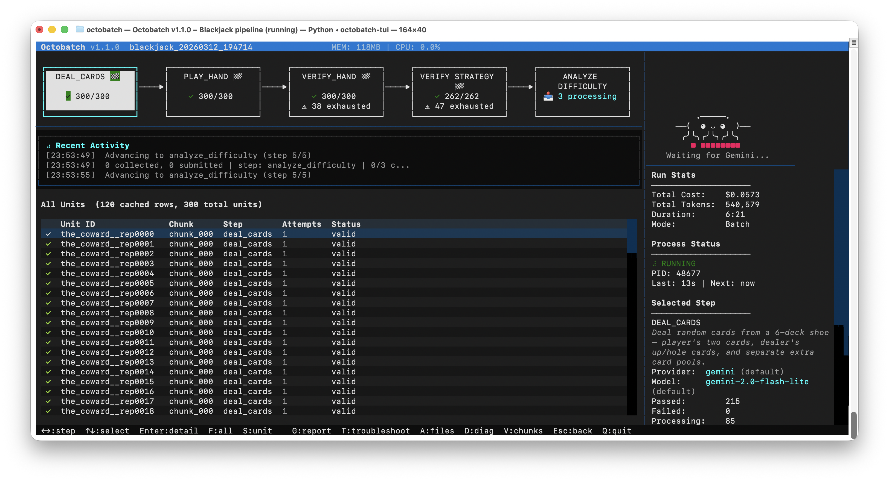
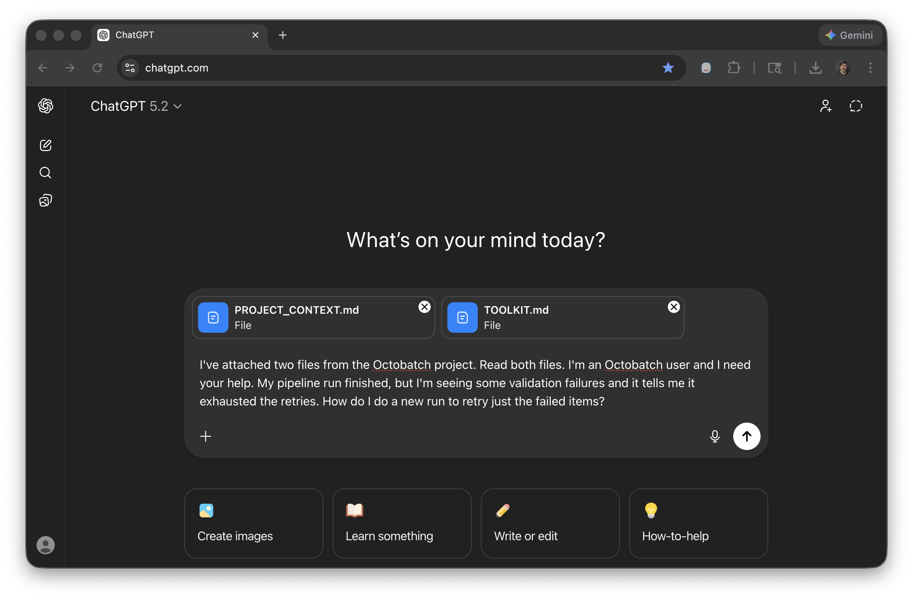
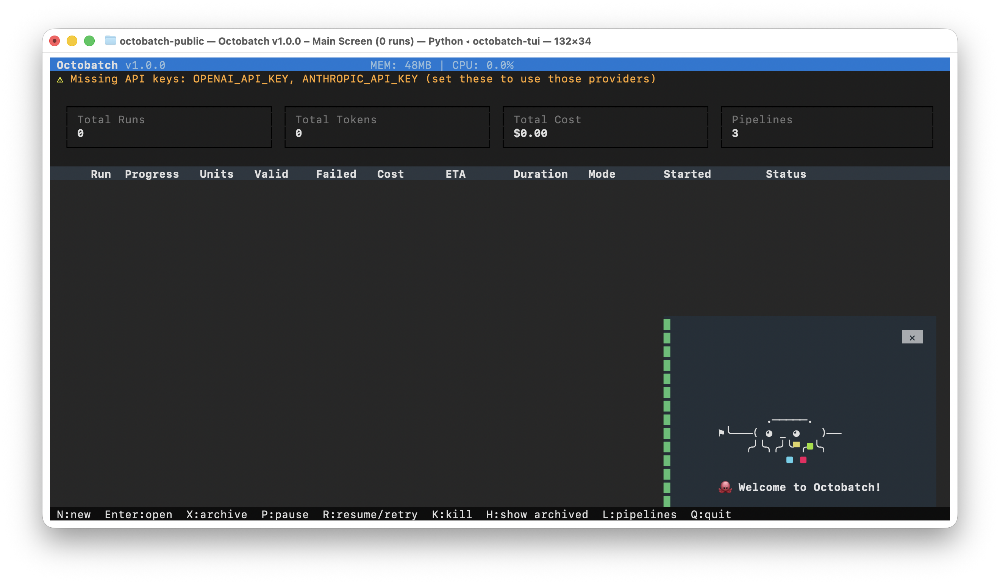
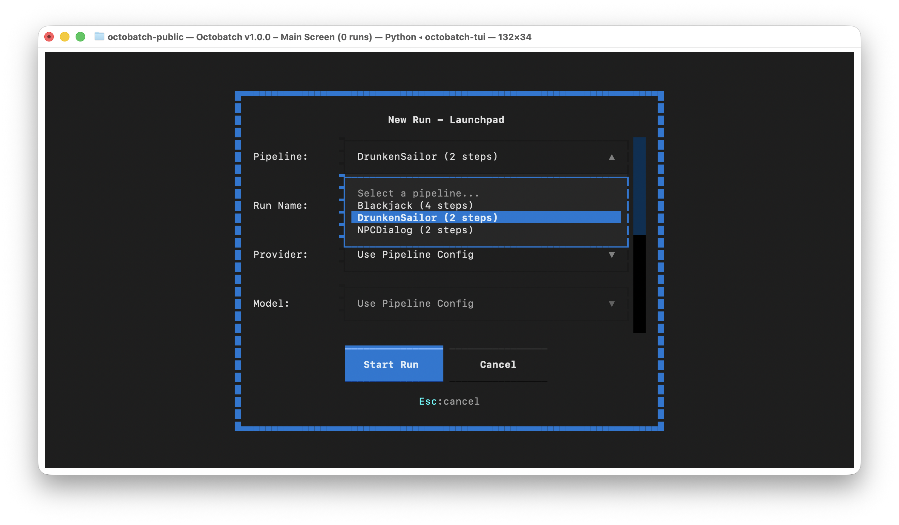
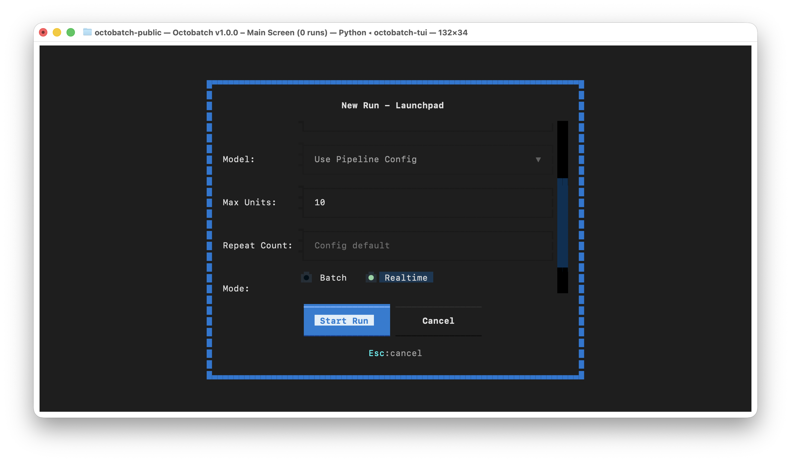
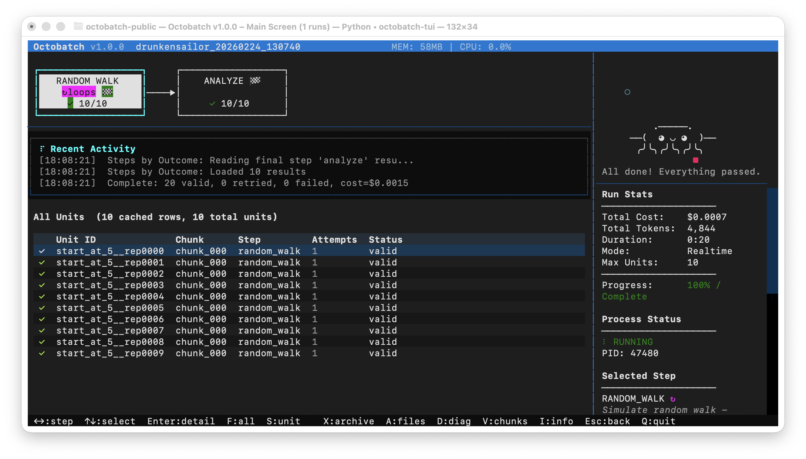
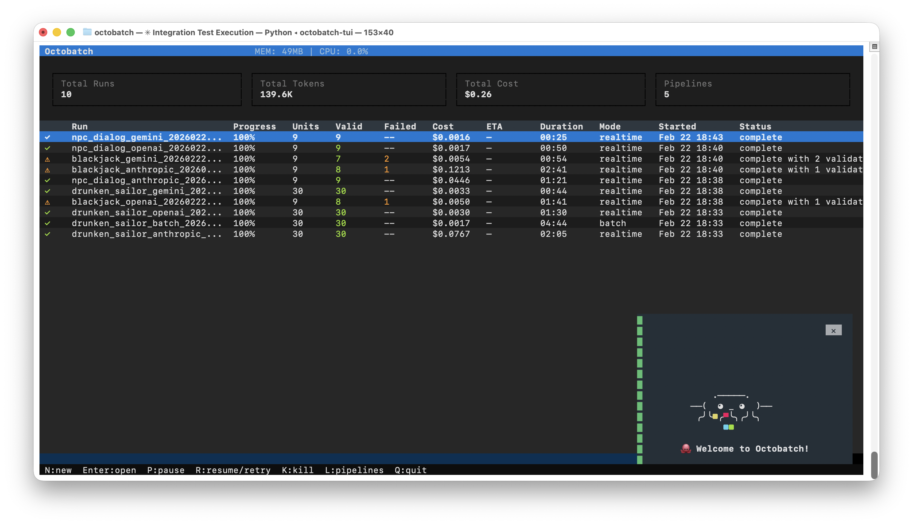
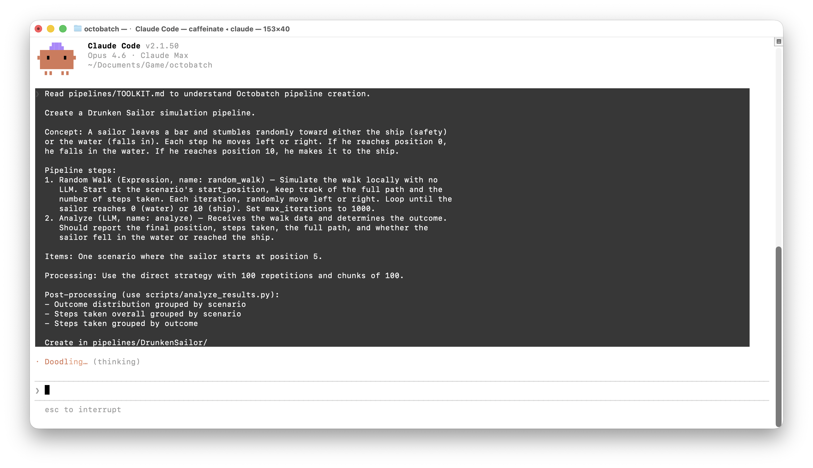

# 🐙 Octobatch

**Process thousands of LLM calls at half the cost.** Octobatch is an open-source orchestrator that chains multiple LLM steps into robust pipelines with automatic validation, retry on failure, and crash recovery.

Describe your pipeline in plain English. Let AI generate the config. Point it at any provider and let it run.

Supports **Gemini**, **OpenAI**, and **Anthropic** — all three with batch and realtime modes.



---

## Table of Contents

- [What Can You Build?](#what-can-you-build)
- [Use Your Favorite AI to Get Help](#use-your-favorite-ai-to-get-help-with-octobatch)
- [Get Running](#get-running)
- [Create Your Own Pipelines](#create-your-own-pipelines)
- [Quick Reference](#quick-reference)
- [Contributing & How Octobatch Is Built](#contributing--how-octobatch-is-built)
- [License](#license)

---

## What Can You Build?

Octobatch handles any workflow where you need to process structured data through LLMs at scale.

**Monte Carlo Simulations** — Run thousands of randomized trials with seeded reproducibility and statistical validation.

**Synthetic Data Generation** — Generate and quality-gate thousands of structured outputs across categories.

**LLM-as-Judge Validation** — Use one model to generate content, another to evaluate it, with automatic retry on low scores.

### Included Demo Pipelines

Three working pipelines are included. Each walkthrough includes the exact Claude Code prompt used to create it, so you can see how a plain-English description becomes a complete pipeline.

🍺 **Drunken Sailor** — A Monte Carlo simulation where a sailor stumbles randomly along a pier until he reaches the ship or falls in the water. A local code step runs the random walk (free, instant), then an LLM analyzes the outcome. 100 trials verify the theoretical 50/50 prediction. Demonstrates local computation with `loop_until` and seeded reproducibility. [Walkthrough →](docs/examples/drunken-sailor.md)

🃏 **Blackjack** — Three blackjack strategies (The Pro, The Gambler, The Coward) play 100 hands each. An expression step deals cards for free, an LLM plays the hand, a second LLM validates that the strategy was followed correctly (retrying bad plays automatically), and a third LLM rates decision difficulty. The validation is intentionally strict — expect some hands to fail even after retries, which is what makes this a good demo of the full retry and failure cycle. Demonstrates the LLM-as-validator pattern with a 4-step pipeline. [Walkthrough →](docs/examples/blackjack.md)

🗣️ **NPC Dialog** — Five RPG personalities × four player moods × three conversation topics = 60 unique dialog exchanges, generated automatically using the cross-product strategy. A second LLM scores each dialog for personality consistency and mood responsiveness, retrying any that fall below threshold. Demonstrates cross-product unit generation and multi-dimensional quality gates. [Walkthrough →](docs/examples/npc-dialog.md)

---

## Use Your Favorite AI to Get Help with Octobatch

Upload two files — `pipelines/TOOLKIT.md` and `ai_context/PROJECT_CONTEXT.md` — to any AI assistant (ChatGPT, Gemini, Claude, Copilot, or whatever you prefer) and ask it anything: how to create pipelines, debug validation failures, resume stuck runs, reduce costs, or understand how expression steps work. You can also paste in screenshots of the TUI and ask "what do I do?" — the AI will read the screen and give you specific advice. The context files contain everything the AI needs to give you accurate, specific answers — it becomes your interactive documentation.



[See the full example conversation →](https://chatgpt.com/share/699dd61e-f6c0-8005-97b0-8d47ea558d73)

---

## Get Running

You need **Python 3.10+**, **git**, and an API key. If you're already comfortable with the command line, the quickstart below has everything you need. If you've never used Python or the terminal before, follow the detailed setup guide for your platform — it walks you through every step.

**Detailed setup guides:** [Mac](docs/mac-setup.md) · [Windows](docs/windows-setup.md)

### Quickstart

**Mac / Linux:**
```bash
git clone https://github.com/andrewstellman/octobatch.git
cd octobatch
python3 -m venv .venv
source .venv/bin/activate
pip install -r requirements.txt
echo "GOOGLE_API_KEY=your-key-here" > .env   # free, no credit card — https://aistudio.google.com/apikey
./octobatch-tui
```

**Windows:**
```cmd
git clone https://github.com/andrewstellman/octobatch.git
cd octobatch
python -m venv .venv
.venv\Scripts\activate
pip install -r requirements.txt
echo GOOGLE_API_KEY=your-key-here > .env
octobatch-tui.bat
```

The launcher scripts automatically activate the virtual environment, so after the initial setup you just need:

```bash
cd octobatch
./octobatch-tui           # Mac/Linux
octobatch-tui.bat         # Windows
```

You can optionally add `OPENAI_API_KEY` and/or `ANTHROPIC_API_KEY` on separate lines in `.env` to use those providers too.

### The dashboard

You'll see the Octobatch home screen with Otto the Octopus welcoming you:



***If you only set up a Gemini key, you'll see warnings about missing OpenAI and Anthropic keys — that's fine. Octobatch works with any single provider.***

This is a full mouse-and-keyboard application that runs inside your terminal — click on buttons, table rows, and form fields, or use the keyboard shortcuts shown in the footer bar.

### Run your first pipeline

Press **N** (or click **N:new** in the footer) to open the New Run dialog. Select **DrunkenSailor** from the pipeline dropdown:



Set the provider to **Gemini**, change Max Units to **5**, pick **Realtime** mode, and click **Start Run**:



The dashboard switches to the detail view where you can watch your pipeline run. Five random walk simulations flow through two steps — a local computation step (free, instant) and an LLM analysis step. Each unit gets a ✓ as it validates.



Press **Escape** to return to the home screen, where you'll see your completed run with cost, duration, and unit counts.

### Try batch mode (50% cheaper)

From the home screen, press **N** again. This time select DrunkenSailor, set Max Units to **30**, and choose **Batch** mode. Batch mode sends all units to the provider's batch API at half the cost. The dashboard polls for results and updates automatically.



As you run more pipelines, they'll all appear on the home screen. Press **X** to archive old runs you don't need anymore, and **H** to toggle whether archived runs are visible. Archived runs are moved to `runs/_archive/` and can be unarchived at any time.

### How it works under the hood

When you start a run, Octobatch launches a background orchestrator process and creates a **run directory** under `runs/` containing everything about that run — the manifest, logs, chunked data, and validated results. You can close the TUI and come back later; the orchestrator keeps running. Everything is driven from the filesystem: the TUI reads the run directories to show progress, and you can inspect, pause, resume, or repair any run at any time.

---

## Create Your Own Pipelines

Octobatch pipelines are created by describing what you want in plain English to any AI coding assistant. The project includes `pipelines/TOOLKIT.md`, a comprehensive reference that any AI can read to understand the full configuration system. You describe your pipeline, the AI generates the complete config, templates, schemas, and validation rules.

### Recommended workflow: Claude Code

The fastest path is [Claude Code](https://docs.anthropic.com/en/docs/claude-code/overview), Anthropic's command-line coding tool. Because it runs inside your project directory, it reads TOOLKIT.md directly and writes the generated files in place — no copying and pasting. You can use any AI tool you want, but with others you'll need to manually save the generated files.

Claude Code requires a [Claude Pro, Max, Team, or Enterprise subscription](https://claude.ai/upgrade). For more details, see the [Claude Code setup guide](https://code.claude.com/docs/en/setup).

**Windows (Command Prompt):**
```cmd
curl -fsSL https://claude.ai/install.cmd -o install.cmd && install.cmd && del install.cmd
```

**Windows (PowerShell):**
```powershell
irm https://claude.ai/install.ps1 | iex
```

**Mac / Linux:**
```bash
curl -fsSL https://claude.ai/install.sh | bash
```

After installation, close and reopen your terminal, then run `claude --version` to verify it's working. On the first run you'll be prompted to log in with your Anthropic account.

### Create a pipeline

Navigate to your octobatch directory and start Claude Code:

```bash
cd octobatch
claude
```

Then type your pipeline description. Here's Claude Code generating the Drunken Sailor demo pipeline:



Claude Code reads the toolkit reference and generates a complete, working pipeline — config, templates, schemas, items file, and validation rules. You can then launch it from the TUI by pressing N.

### Pipeline ideas to try

Each of these prompts creates a ready-to-run pipeline:

- *"Read pipelines/TOOLKIT.md, then create a pipeline that generates 500 product descriptions across 5 categories, scoring each for brand voice consistency."*
- *"Read pipelines/TOOLKIT.md, then create a pipeline where GPT generates customer support responses and Claude scores them for empathy and accuracy, retrying any below 0.7."*
- *"Read pipelines/TOOLKIT.md, then create a Monte Carlo simulation that models portfolio returns under different interest rate scenarios."*
- *"Read pipelines/TOOLKIT.md, then create a pipeline that generates exam questions from a textbook chapter and uses a second LLM to verify the answers."*
- *"Read pipelines/TOOLKIT.md, then create a pipeline that simulates 1,000 coin flip sequences and analyzes streak patterns using an expression step for the flips and an LLM to interpret the statistics."*

### Iterate

Keep your AI tool open alongside the TUI. The workflow is:

1. Describe your pipeline and let the AI generate it
2. Run a small test from the TUI (press N, set max units to 5, choose realtime)
3. Look at the results — check for validation failures, inspect the output
4. Tell the AI what's wrong: *"I'm getting 30% failures on the scoring step — the LLM is returning integers instead of floats"*
5. Let it fix the templates or validation rules, then run again

Most pipelines take 2–3 iterations to get right. The TUI's failure inspection tools (press Enter on a unit, then R for raw response) give you exactly what the AI needs to diagnose problems.

### Debugging validation failures

When units keep failing, use the TUI to inspect what went wrong: open the run, find a failed unit, and press R to see the raw LLM response. Then tell your AI what happened:

> *"My NPC Dialog scoring step keeps failing. Here's what a failed unit looks like: the Gruff Blacksmith got a 0.2 mood responsiveness score when a friendly player approached. The blacksmith was cold to the player, but that seems like correct behavior for a gruff character. Why is validation failing and how do I fix it?"*

In that case, the fix was to clarify in the prompt that mood responsiveness means "did the NPC react to the player's mood in a way that fits their personality" rather than "did the NPC mirror the player's mood." The kind of nuance that's hard to get right on the first try, but easy to fix once you see the actual scores and describe them to an AI.

---

## Quick Reference

### AI prompts for common tasks

Copy and paste these prompts into your AI assistant. Upload the referenced files along with them.

| File | What it contains |
|------|-----------------|
| `pipelines/TOOLKIT.md` | Complete pipeline creation reference |
| `ai_context/PROJECT_CONTEXT.md` | System architecture and design patterns |
| `ai_context/DEVELOPMENT_CONTEXT.md` | Current development state and bootstrap chain |
| `scripts/CONTEXT.md` | Orchestrator internals (for debugging) |
| `scripts/tui/CONTEXT.md` | TUI internals (for debugging) |

**Creating a pipeline** — upload `TOOLKIT.md`:

```
I've attached the Octobatch toolkit. I want to create a pipeline that [describe what you want].
```

**Getting help with a problem** — upload `TOOLKIT.md` and `PROJECT_CONTEXT.md`:

```
I've attached two files from the Octobatch project. Read both files. I'm an Octobatch user and I need help. [describe your problem]
```

You can also paste in screenshots of the TUI — the AI will read the screen and tell you what to do.

**Doing development work** — point your AI coding assistant (Claude Code, Cursor, Copilot) at the bootstrap prompt:

```
Read ai_context/DEVELOPMENT_CONTEXT.md and bootstrap yourself to continue development.
```

**Running integration tests** — use Claude Code with `--dangerously-skip-permissions`:

```
Read tests/RUN_INTEGRATION_TESTS.md and run the full integration test suite.
```

**Running a code review** — give this to two or more AI tools independently, then cross-reference findings:

```
Read tests/RUN_CODE_REVIEW.md and review the changes from the last commit: git diff HEAD~1
```

### Providers

| Provider | API Key | Default Model | Get a key |
|----------|---------|---------------|-----------|
| Gemini | `GOOGLE_API_KEY` | gemini-2.0-flash-001 | [Google AI Studio](https://aistudio.google.com/apikey) |
| OpenAI | `OPENAI_API_KEY` | gpt-4o-mini | [OpenAI Platform](https://platform.openai.com/api-keys) |
| Anthropic | `ANTHROPIC_API_KEY` | claude-sonnet-4-20250514 | [Anthropic Console](https://console.anthropic.com/) |

All three support batch mode (50% discount) and realtime mode.

### Updating model pricing

LLM providers frequently change their models and pricing. To keep Octobatch's cost tracking accurate, periodically run:

```bash
python3 scripts/maintenance/update_models.py
```

This fetches current model lists and pricing from each provider's API and updates the registry. Supports `--dry-run` and `--provider gemini` for targeted updates.

### Common commands

If you prefer the command line over the TUI, these commands will get you started. You can use your favorite AI to get more help.

```bash
# Launch the TUI dashboard
./octobatch-tui

# Create and run from the command line (realtime)
./octobatch --init --pipeline MyPipeline --run-dir runs/test \
    --realtime --max-units 10 --provider gemini --yes

# Create and run (batch — 50% cheaper)
./octobatch --init --pipeline MyPipeline --run-dir runs/prod --provider gemini --yes
./octobatch --watch --run-dir runs/prod

# Check run status
./octobatch --ps
./octobatch --info --run-dir runs/prod

# Verify and repair after a crash
./octobatch --verify --run-dir runs/prod
./octobatch --repair --run-dir runs/prod --yes

# Update model pricing (run periodically to keep cost tracking accurate)
python3 scripts/maintenance/update_models.py
```

All launcher scripts (`./octobatch`, `./octobatch-tui`) automatically activate the virtual environment.

Windows: use `octobatch.bat` and `octobatch-tui.bat` instead.

---

## Contributing & How Octobatch Is Built

Octobatch is an experiment in agentic engineering — building production software through conversation with AI coding assistants rather than writing code by hand. The developer describes what to build, AI generates the implementation, multiple AI models review each other's work, and the developer makes architectural decisions. The entire codebase, documentation, test infrastructure, and even this README were created this way.

The development workflow uses three AI models in different roles: Claude for strategic planning and code generation, Gemini for architectural review and catching blind spots, and GPT for logic verification and edge case discovery. During our pre-release code review, 74% of bugs were found by only one of the three models — proving that no single AI is sufficient for quality assurance.

A persistent system of markdown context files (`CONTEXT.md`, `QUALITY.md`, `TOOLKIT.md`) gives every AI session the same shared understanding of the project's architecture, quality standards, and design decisions. This solves the fundamental problem of AI-assisted development: stateless sessions that would otherwise start from scratch every time.

We're publishing a detailed write-up of this methodology on O'Reilly Radar — link coming soon. <!-- TODO: Add link to O'Reilly Radar article when published March 5, 2026 -->

If you're interested in contributing, [docs/contributing.md](docs/contributing.md) covers the development setup, the context file system, and the quality processes (code reviews, integration tests, and the Council of Three regression methodology). If your AI assistant can't resolve a problem, please [open an issue on GitHub](https://github.com/andrewstellman/octobatch/issues).

## License

[MIT](LICENSE)

---

*Built with Claude, Gemini, and GPT.*
